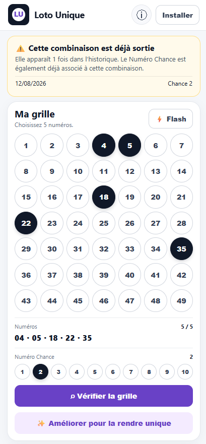

# Loto Unique

Application d'aide a la création de grille unique pour le LOTO et EuroMillions

## Démo

L'application est déployée ici :

https://anne-sophie-tech.github.io/euromillions-check/

## Fonctionnalités

- sélection manuelle des 5 numéros + Numéro Chance pour le LOTO 
- sélection manuelle des 5 numéros + 2 étoiles pour EuroMillions 
- Flash attendu qui privilégie les numéros et étoiles avec le plus grand retard de sortie, lorsque l'historique est disponible 
- vérification d'une combinaison dans l'historique du jeu sélectionné 
- indication des dates d'occurrence 
- bouton « Améliorer pour la rendre unique » qui cherche une grille inédite en modifiant le minimum de numéros 
- installation sur Android et iOS 
- aucune donnée utilisateur 

## Données

`data/history.json` et `data/euromillions_history.json` sont générés à partir des archives publiques officielles de la FDJ. La FDJ publie les archives LOTO et EuroMillions par périodes. 
Les périodes antérieures à octobre 2008 ne sont pas utilisées pour le contrôle d'une combinaison actuelle de 5 numéros, car le jeu comportait alors 6 boules principales.

Les workflows GitHub Actions `Update Loto history` et `Update EuroMillions history` mettent à jour les données quotidiennement et peuvent être lancés manuellement.

L'application refuse de déclarer une grille « unique » si l'historique chargé est absent ou manifestement incomplet.

## Important sur l'« unicité »

Une combinaison jamais sortie n'a pas une probabilité supérieure au prochain tirage. 
L'application répond seulement à la question historique : « cette combinaison est-elle déjà apparue ? ».
